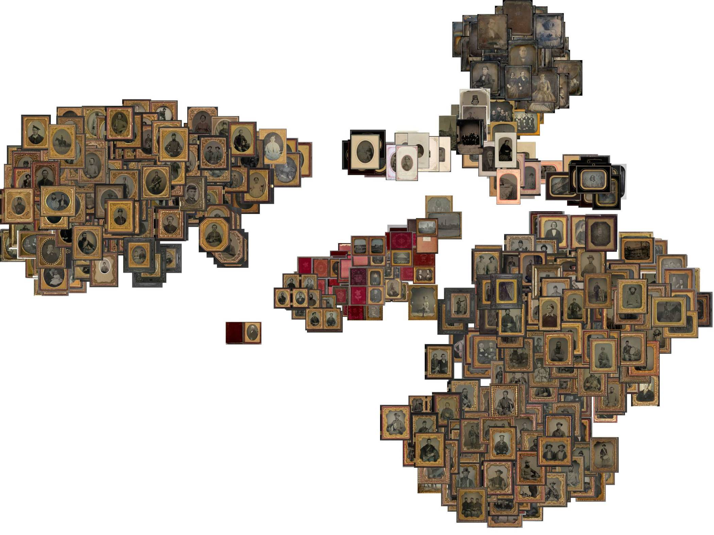

## 🤖 Inteligencia artificial y fotografía

Desde hace años, en mis tiempos libres, he estado aprendiendo y experimentando con las tecnicas de inteligencia artificial (IA) para aplicarlas a las tareas de la conservación y los archivos. Uno de esos ejercicios ha consistido en explorar cómo se agrupan fotografías según sus rasgos visuales.

<!--more-->

## 🔗 Resultado

Mi primer resultado lo he compartido en un repositorio de Github que contiene el cuaderno de Jupyter, el conjunto de datos y la lista de paquetes necesarios. Lo puedes encontrar aqui [https://github.com/gustavolsj/image-recognition](https://github.com/gustavolsj/image-recognition)

## 🤔 Justificación

A lo largo de la historía la fotografía ha evolucionado materialmente pasando de soportes rigidos y pesados como el vidrio y el metal a soportes ligeros y flexibles como los plásticos y el papel.

Cada uno de estos avances le da a los objetos fotográficos características físicas unicas que en un archivo es importante reconocer ya que nos ayudan a conocer su contexto histórico, saber de qué técnicas están hechos y decidir mejores estrategias de conservación.

La forma más sencilla de aplicar la IA a esta tarea es proporcionando un conjunto heterogeneo de imagenes para ver de qué manera las organiza o clasifica, ya que estas herramientas no han sido entrenadas específicamente para historia de la fotografía.

El resultado es una imagen como la que se muestra arriba, en la que 250 fotografías de cuatro técnicas diferentes son agrupadas por sus principales rasgos visuales, pero que no coinciden con su clasificación técnica tradicional.

## ⚙️Funcionamiento

Para este experimento seguí los pasos de esta [guía](https://github.com/ml4a/ml4a/blob/master/examples/info_retrieval/image-tsne.ipynb)

Y escribí un artículo donde explicó con más detalle las motivaciones de este experimeto y los aspectos técnicos detras de él, lo puedes leer [aquí](https://www.academia.edu/92501941/Identificaci%C3%B3n_del_proceso_fotogr%C3%A1fico_a_partir_del_uso_de_herramientas_de_visi%C3%B3n_por_computador)
