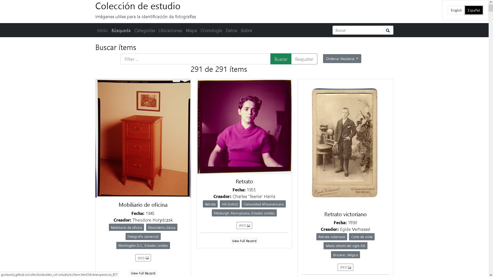

## Creación de colecciones digitales con CB

[CollectionBuilder](https://collectionbuilder.github.io/cb-docs/) (CB) es un conjunto de herramientas de código abierto para crear sitios web de colecciones digitales y exhibiciones, permite mostrar imagenes, videos, audios y pdfs, hacer búsquedas, filtrar por diferentes criterios, visualizarlos en un mapa, en una linea del tiempo y exportar sus metadatos en diferentes formatos de texto plano.

El proyecto esta dirigido a investigadores, estudiantes y archivos pequeños que no cuentan con la infraestructura tecnologica o conocimientos avanzados en programación o diseño web, o persnas que requieren una solución rápida y sencilla para publicar sus colecciones digitales en la web.

<!--more-->

## Resultado

CB tiene tres versiones que se diferencian por su complejidad y capacidades, las he probado con la misma coleccion de objetos digitales para comparar sus resultados, faclidad de uso y capacidad de personalizacion, los resultados se pueden ver en los siguientes enlaces:

La versión más sencilla es [CollectionBuilder Sheets](https://gustavolsj.github.io/collectionbuilder-sheets-demo/), que permite crear una colecciones digital en linea en unos minutos, partiendo simplemente de una hoja de calculo de Google Sheets con los metadatos de la colección. Esta pensado para servir como un demo en talleres introductorios que permitan conocer y experimentar con la herramienta y posteriormente migrar a alguna de las otras versiones.

La segunda versión es [CollectionBuilder GH](https://github.com/gustavolsj/collectionbuilder_col-estudio/), que permite crear colecciones digitales a partir de un archivo de metadatos en formato CSV y un repositorio de Github, esta pensado para usuarios que quieran aprender a usar GitHub y Markdown para tener un mayor control sobre la personalización del sitio web de la colección.

La tercera versión es [CollectionBuilder CSV](https://gustavolsj.github.io/collectionbuilder-csv-col-estudio/) que permite obtener un conjunto de archivos HTML que se pueden hospedar en cualquier servidor web, por ejemplo el sitio institucional de una archivo. CB CSV esta pensado para usuarios que ya tienen conocimientos previos y que buscan tener un control total sobre su sitio web. Esta version es la que los desarrolladores actuzalizan más frecuentemente y que tiene más funcionalidades que no se estan disponibles en las otras dos versiones (como la busqueda avanzada).

## Funcionamiento

CollectionBuilder se basa en el concepto de [LibStatic](https://lib-static.github.io/about/) que es una metodología de desarrollo que aprovecha las tecnologias web estaticas y las habilidades de los bibliotecarios para crear publiaciones web con infraestructura mínima. Algunos de los principios detrás de este enfoque buscan que estas tecnologías sean: abiertas, enfocado en los usuarios, sencillas y optimizadas para bibliotecas y archivos.

- [Ver todas las aplicaciones](/aplicaciones/)
